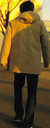
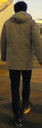
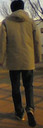
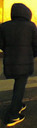
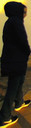
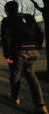
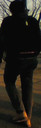
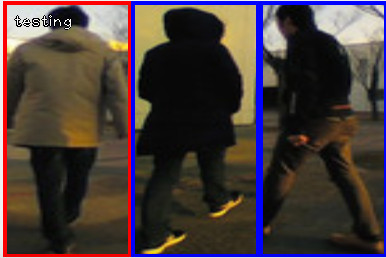

# ccf_person_identification

This package is an implementation of person identification based on the combination of Convolutional Channel Features and Online boosting. It takes advantage of deep feature representation while adapting the person classifier to a specific target person.

## Example

Test images can be found in *"ccf_person_identification/data/test"*.

```bash
rosrun ccf_person_identification ccf_person_identification_test
```

### Training images

Positive images

  

Negative images

  
  


### Test images

confidence: 0.545271, -0.545632, -0.540605



Extracted and selected features


## Related packages

- [ccf_person_identification](https://github.com/koide3/ccf_person_identification)
- [monocular_people_tracking](https://github.com/koide3/monocular_people_tracking)
- [monocular_person_following](https://github.com/koide3/monocular_person_following)


## Papers
- Kenji Koide, Jun Miura, and Emanuele Menegatti, Monocular Person Tracking and Identification with Online Deep Feature Selection for Person Following Robots, Robotics and Autonomous Systems [[link]](https://www.researchgate.net/publication/336871285_Monocular_Person_Tracking_and_Identification_with_On-line_Deep_Feature_Selection_for_Person_Following_Robots).


- Kenji Koide and Jun Miura, Convolutional Channel Features-based Person Identification for Person Following Robots, 15th International Conference IAS-15, Baden-Baden, Germany, 2018 [[link]](https://www.researchgate.net/publication/325854919_Convolutional_Channel_Features-Based_Person_Identification_for_Person_Following_Robots_Proceedings_of_the_15th_International_Conference_IAS-15).
